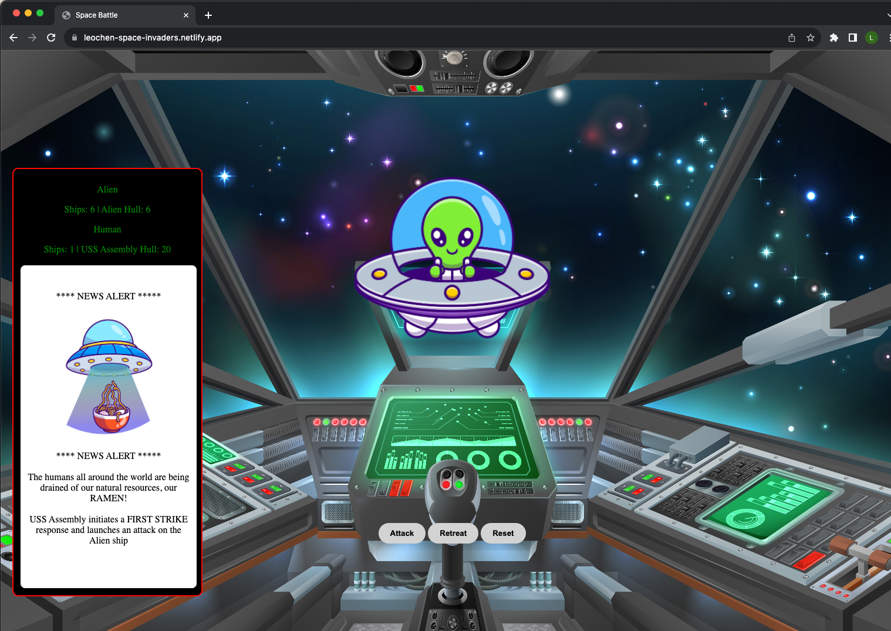
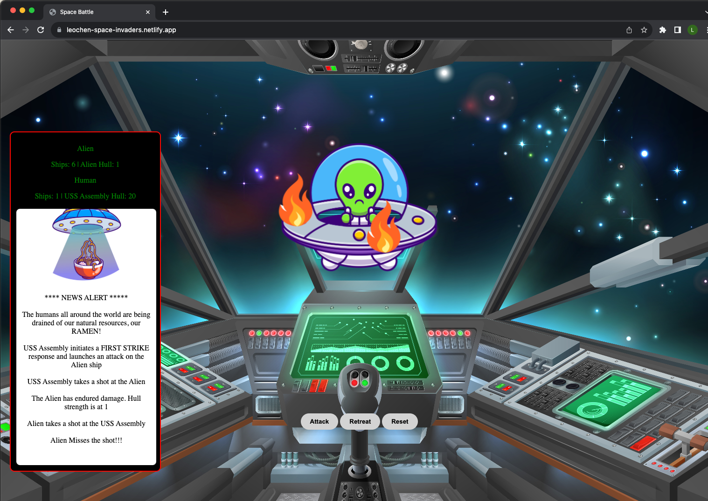
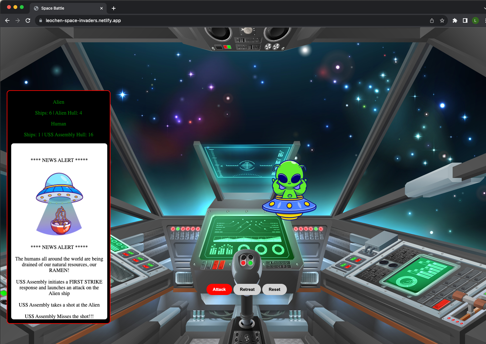
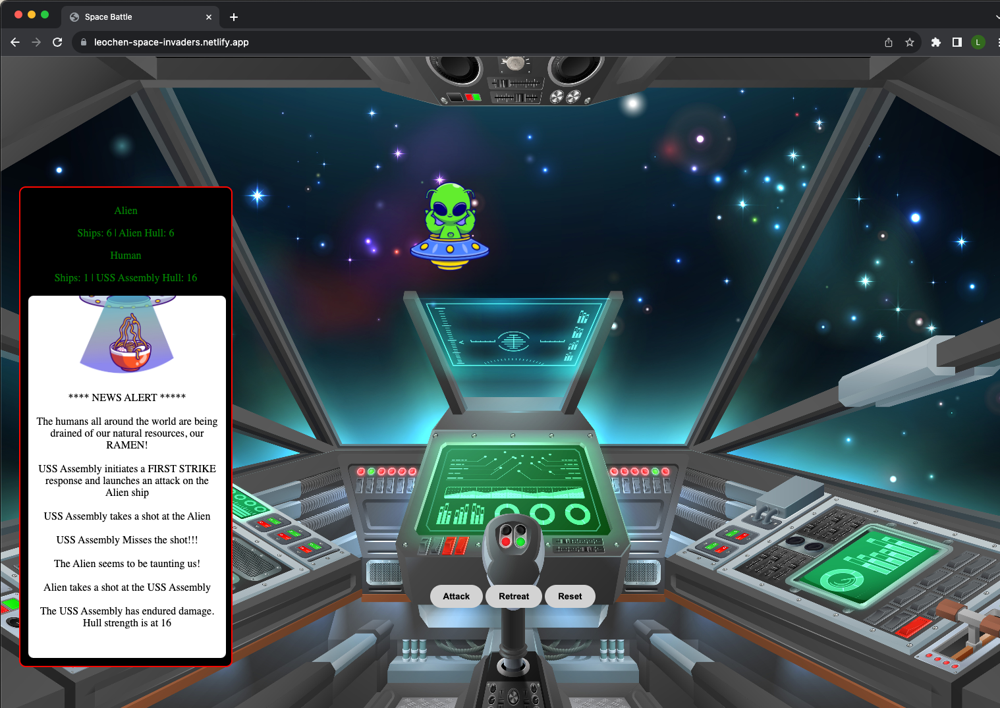
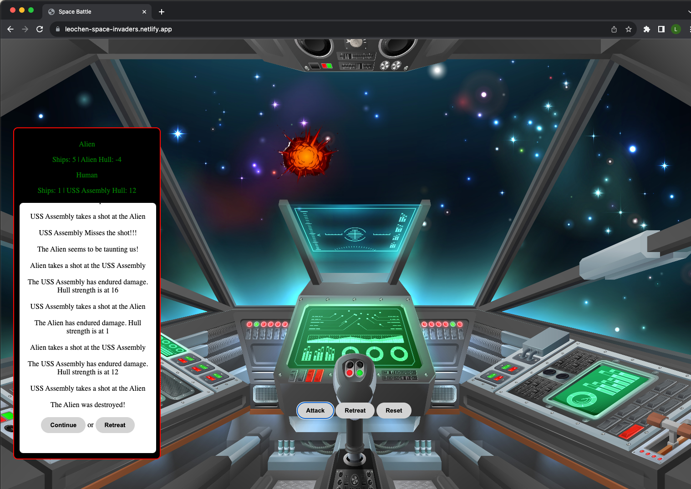
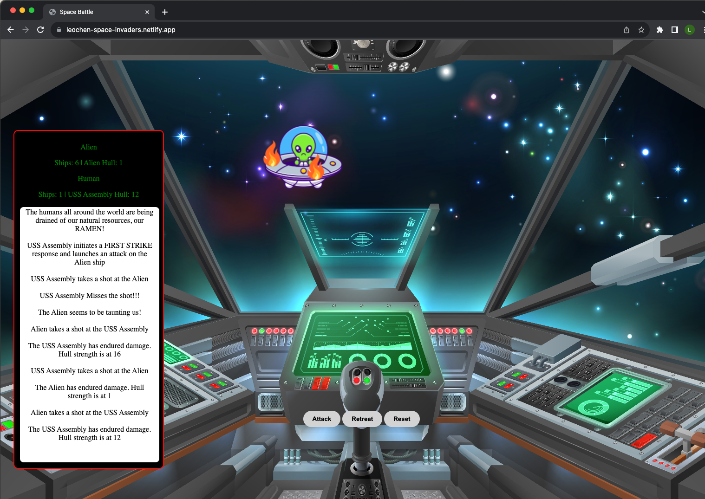

[Link to Space Battle Game] (https://leochen-space-invaders.netlify.app/)

# Introduction
One of the first few projects we started at Per Scholas using vanilla javascript and the DOM. You will notice I have multiple versions of the javascript files all the way to v8. This was before we learned much about Git and Branches. I have left it here to show myself in the future my progression in learning to code.

## Project Description
The world is under attack! The alien is after out natural resources, our Ramen. You are the captain of the USS Assembly, on a mission to destroy every last alien ship. Battle the aliens as you try to destroy them with your lasers.

There are six alien ships. The aliens' weakness is that they are too logical and attack one at a time: they will wait to see the outcome of a battle before deploying another alien ship. Your strength is that you have the initiative and get to attack first. However, you do not have targeting lasers and can only attack the aliens in order. After you have destroyed a ship, you have the option to make a hasty retreat.

# Screenshot 1

# Screenshot 2

# Screenshot 3

# Screenshot 4

# Screenshot 5

# Screenshot 6

# Technologies Used
- HTML
- CSS
- Javascript

# Future Enhancements
- Add Alien beaming up Ramen at intro
- Add Star Wars intro scroll at startup
